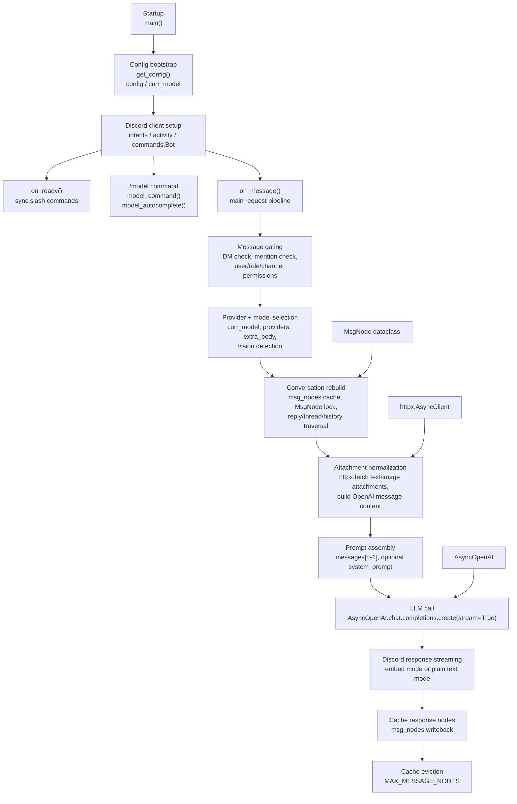
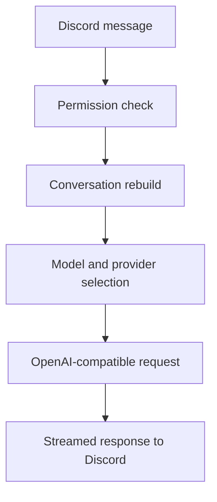

# ARCHITECTURE

## Overview

The current project is a single-process Discord bot built around `discord.py`, `httpx`, `openai`, and a YAML config file.

The target architecture should keep the same lightweight deployment style, but split responsibilities into clear layers so the bot can grow into a study assistant.

## Code navigation map

Use this diagram as the fastest way to find runtime behavior in the current codebase. Everything below currently lives in `llmcord.py`.



## File guide

- `llmcord.py:32-34` loads YAML with `get_config()`.
- `llmcord.py:37-48` initializes global runtime state such as `config`, `curr_model`, `msg_nodes`, the Discord bot, and the shared `httpx` client.
- `llmcord.py:51-63` defines `MsgNode`, the cache structure used during conversation reconstruction.
- `llmcord.py:66-93` contains the `/model` slash command and autocomplete logic.
- `llmcord.py:96-101` contains `on_ready()`, which logs the invite URL and syncs commands.
- `llmcord.py:104-327` contains `on_message()`, which is the core pipeline for permissions, context rebuilding, attachment parsing, model calls, streaming replies, and cache eviction.
- `llmcord.py:330-337` contains `main()` and process startup.

## Current architecture

### Runtime flow



### Current building blocks

- **Discord layer**: `discord.py` handles events, slash commands, and replies.
- **Config layer**: `config.yaml` drives models, providers, permissions, and behavior.
- **Context layer**: message history is reconstructed from replies, threads, and nearby messages.
- **LLM layer**: `AsyncOpenAI` talks to any OpenAI-compatible provider.
- **Attachment layer**: text and image attachments are fetched with `httpx`.
- **Cache layer**: `msg_nodes` stores message state in memory.

### Current strengths

- Simple deployment.
- Easy provider swapping.
- Hot-reloadable config.
- Good foundation for a private server.

### Current limitations

- One file contains most behavior.
- No explicit task routing.
- No persistent knowledge base.
- No search/retrieval pipeline.
- No structured support for study data.

## Target architecture

### Layers

```text
Discord UI
  -> Command / mode router
  -> Task handlers
  -> Shared services
  -> Storage / search / model providers
  -> Discord response formatter
```

### 1. Discord UI layer

Responsible for:

- slash commands,
- mentions and replies,
- permission checks,
- message formatting,
- progress feedback.

### 2. Router layer

Responsible for:

- identifying the requested mode,
- validating inputs,
- choosing the right handler,
- applying defaults and guardrails.

### 3. Task handlers

Each feature area should become a separate handler:

- **ResearchHandler**: web search, source ranking, ABNT report generation.
- **CodeHandler**: code generation with line-by-line explanations.
- **StudyPlanHandler**: calendar-aware plan construction.
- **ABNTHelper**: references, citations, and structure checks.
- **QuizHandler**: question generation and correction.
- **MonitorHandler**: progress tracking and summaries.
- **KnowledgeHandler**: summaries and search over shared server content.

### 4. Shared services

Reusable services should sit below the handlers:

- **ConfigService**: loads YAML and merges defaults.
- **PermissionService**: user, role, and channel access rules.
- **ModelService**: provider/model selection and request building.
- **SearchService**: external web search and result normalization.
- **CitationService**: ABNT formatting.
- **StudyService**: timetable and plan generation.
- **KnowledgeService**: ingestion and search of server material.
- **ResponseService**: Discord-friendly rendering, including file attachments for long outputs.

### 5. Storage layer

The first stable storage choice should stay lightweight.

**Good candidates**
- in-memory cache for conversation state,
- local files for lightweight artifacts,
- SQLite for persistent study progress, quizzes, references, and server notes.

**What belongs here**
- study plans,
- progress records,
- question banks,
- source indexes,
- curated notes,
- generated references.

### 6. Model/providers layer

Keep the current OpenAI-compatible abstraction.

**Supports**
- OpenAI,
- OpenRouter,
- Groq,
- Mistral,
- xAI,
- Google,
- local servers like Ollama, LM Studio, and vLLM.

### 7. External data layer

This is where the study features become useful.

**Sources**
- web search engines or search APIs,
- official documentation,
- public legal sources,
- PDFs and notes shared in the server,
- user-generated summaries and references.

## Data flows by mode

### Research mode

```text
Request
  -> search
  -> source ranking
  -> evidence extraction
  -> report generation
  -> citation formatting
```

### Code mode

```text
Request
  -> language selection
  -> snippet generation
  -> line/block explanations
  -> reference links
```

### Study-plan mode

```text
Topics + exam date + free time
  -> workload estimation
  -> schedule assembly
  -> review/practice insertion
  -> plan output
```

### ABNT helper

```text
Source material
  -> metadata extraction
  -> citation/reference formatting
  -> validation hints
```

### Quiz/simulado

```text
Topics + difficulty + question count
  -> question generation
  -> answer evaluation
  -> explanation output
```

### Monitoria

```text
User activity + study events
  -> progress aggregation
  -> weak-topic detection
  -> summary report
```

## Recommended module boundaries

If the project is later split into files, this is the cleanest shape:

- `bot.py` for startup and Discord bootstrap.
- `config.py` for config loading and validation.
- `router.py` for mode selection.
- `handlers/` for each feature area.
- `services/` for shared utilities.
- `storage/` for persistence.
- `formatters/` for Discord output and citations.

## Operational principles

- Keep the bot private-server friendly.
- Prefer explicit modes over one giant prompt.
- Prefer structured outputs over free-form text.
- Preserve the current OpenAI-compatible provider model.
- Keep search, retrieval, and generation separate.
- Use persistence only when the feature truly needs it.

## First architecture milestone

The first milestone should be:

1. one Discord bot,
2. one router,
3. several handlers,
4. shared services,
5. a small persistent store,
6. predictable output formats.

